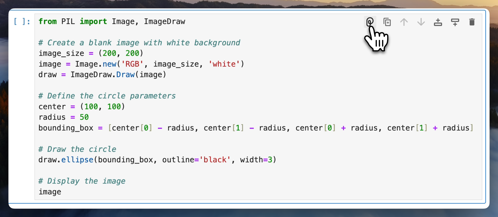
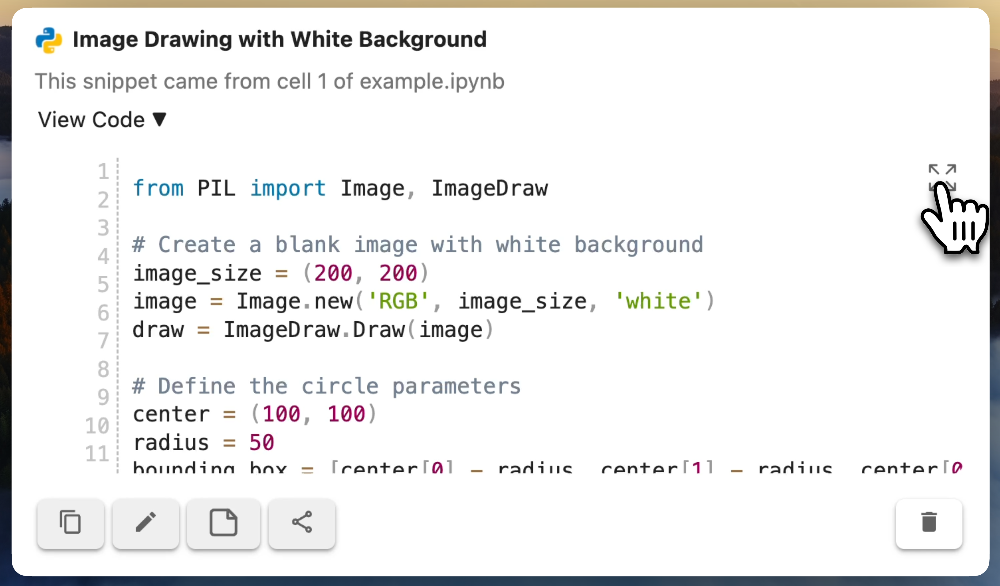
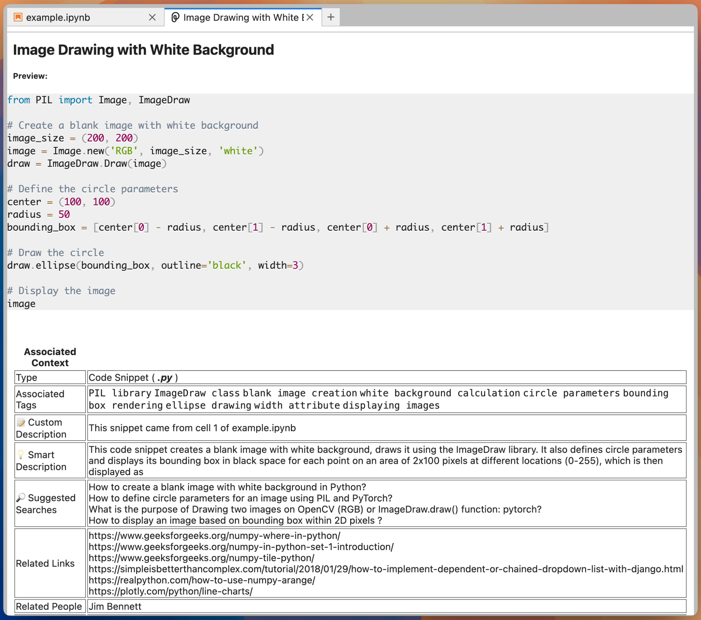

Pieces allows you to save code snippets and automatically add context using AI. This helps you keep track of important code, make it easily searchable, and provide additional information like tags and relevant documentation links.

## Prerequisites

Before you begin, ensure you have:

- [Pieces OS](/installation-getting-started/what-am-i-installing) installed on your machine.
- [Python](https://www.python.org/downloads/) installed on your machine.
- [JupyterLab](https://jupyterlab.readthedocs.io/en/latest/getting_started/installation.html) installed on your machine and running.
- A code snippet to save inside a code cell in a JupyterLabs notebook.

Example code snippet:

```python
from PIL import Image, ImageDraw

# Create a blank image with white background
image_size = (200, 200)
image = Image.new('RGB', image_size, 'white')
draw = ImageDraw.Draw(image)

# Define the circle parameters
center = (100, 100)
radius = 50
bounding_box = [center[0] - radius, center[1] - radius, center[0] + radius, center[1] + radius]

# Draw the circle
draw.ellipse(bounding_box, outline='black', width=3)

# Display the image
image
```

Or download as a Python notebook [here](./resources/example.ipynb).

## Steps

### 1. Identify the code snippet you want to save

In your JupyterLab notebook, find the code cell you want to save as a snippet.

### 2. Use the Pieces button to save the code snippet

In the top right of the code cell is a Pieces button. Select this button to save the current cell to Pieces.



:::info
If you only want to save part of a code cell, you can select just the code you want to save, right-click, and select **Save Selection to Pieces**.
:::

### 3. Review the Context

After processing, review the snippet and the added context:

1. Open the Pieces View from the Ribbon Menu if it is not already open.
1. Select the snippet in the list of saved materials if it is not already selected.
1. Expand the code using the **View Code** dropdown

    

    You will see the code with a generated description.

1. Select the **Expand Code Snippet** button to see the metadata automatically added by Pieces.

    

    The snippet will be opened up as a new tab in JupyterLab.

    

    This includes:

    - A description of the code snippet
    - Suggested searches for similar snippets
    - Suggested links for more information
    - Tags
    - Related files and folders
    - Related people

## Next Steps

- [Manage your code snippet in Pieces for Developers desktop app](/features/managing-saved-materials)
- [Share your code snippet](/features/one-click-snippet-sharing)
- [Transforming your code snippet](/features/transforming-snippets)
