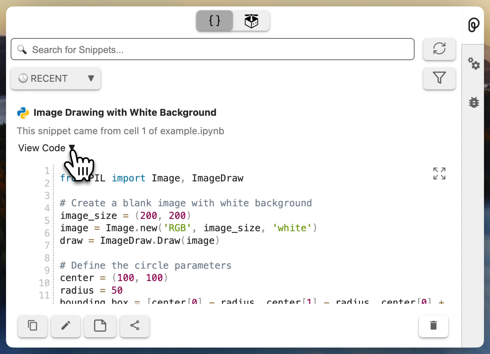
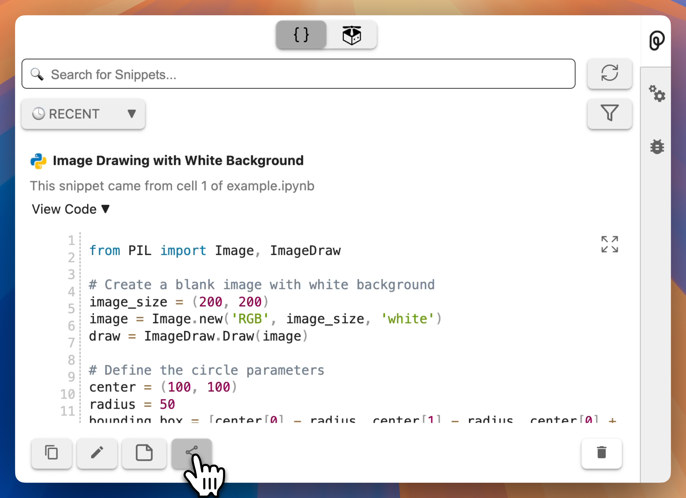
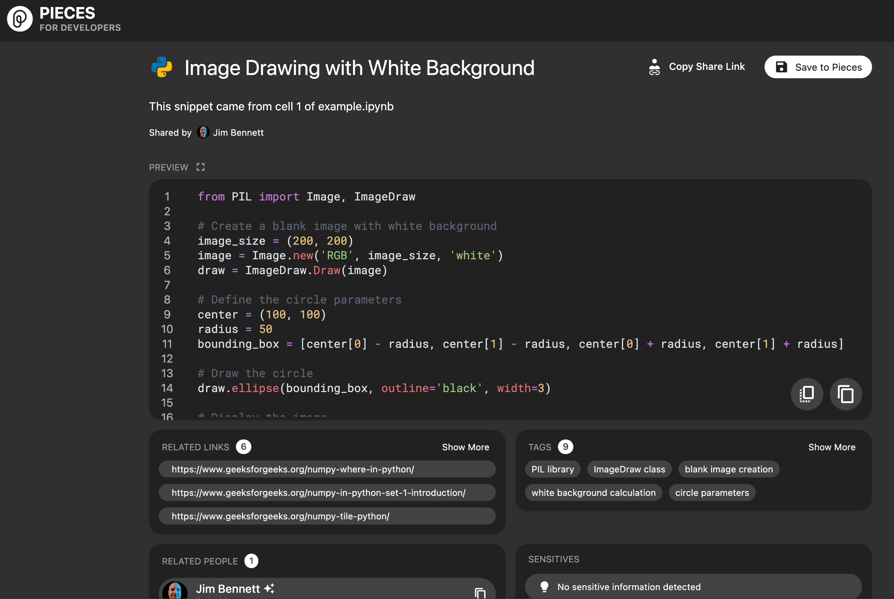

Code snippets saved to Pieces can be shared with others. When you share a code snippet, both the code and the annotations are shared.

## Prerequisites

Before you begin, ensure you have:

- [Pieces OS](/installation-getting-started/what-am-i-installing) installed on your machine.
- [Python](https://www.python.org/downloads/) installed on your machine.
- [JupyterLab](https://jupyterlab.readthedocs.io/en/latest/getting_started/installation.html) installed on your machine and running.
- A code snippet saved to Pieces. If you don't have a code snippet saved, check out our [save a snippet guide](./save-a-snippet).

## Steps

### 1. Identify the code snippet you want to share

1. Open the Pieces View from the Ribbon Menu if it is not already open.
1. Find the snippet in the list of saved materials.
1. Expand the code using the **View Code** dropdown

    

### 2. Copy the snippets sharable link

In the code panel for the snippet is a button to copy the sharable link for the snippet. This will generate a sharable a link the first time it is selected. Select this button to generate the sharable link.

Once the link has been shared, you will see a toast notification that the link has been copied to the clipboard.

### 3. Share the link

You can now share this link. When this link is opened, it will take you to a web page with the code and the generated annotations. The recipient can then save this to Pieces from that page.

## Next Steps

- [Manage your code snippet in Pieces for Developers desktop app](/features/managing-saved-materials)
- [Transforming your code snippet](/features/transforming-snippets)
