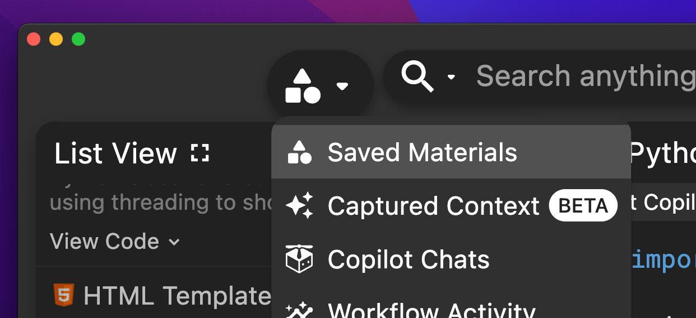
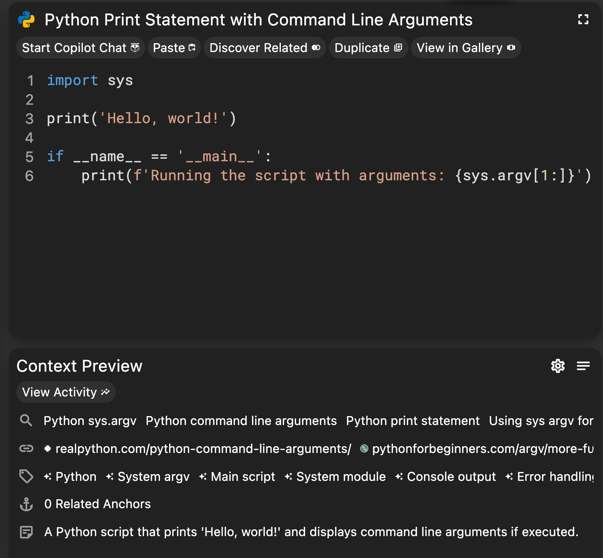
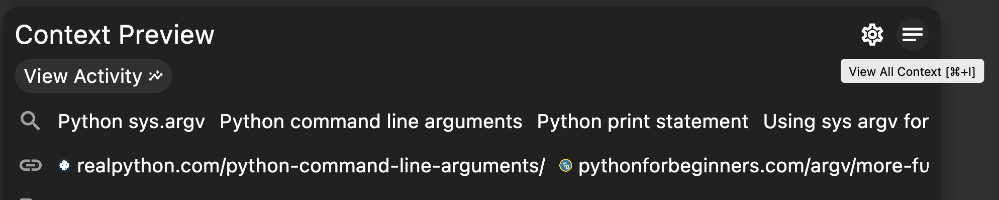
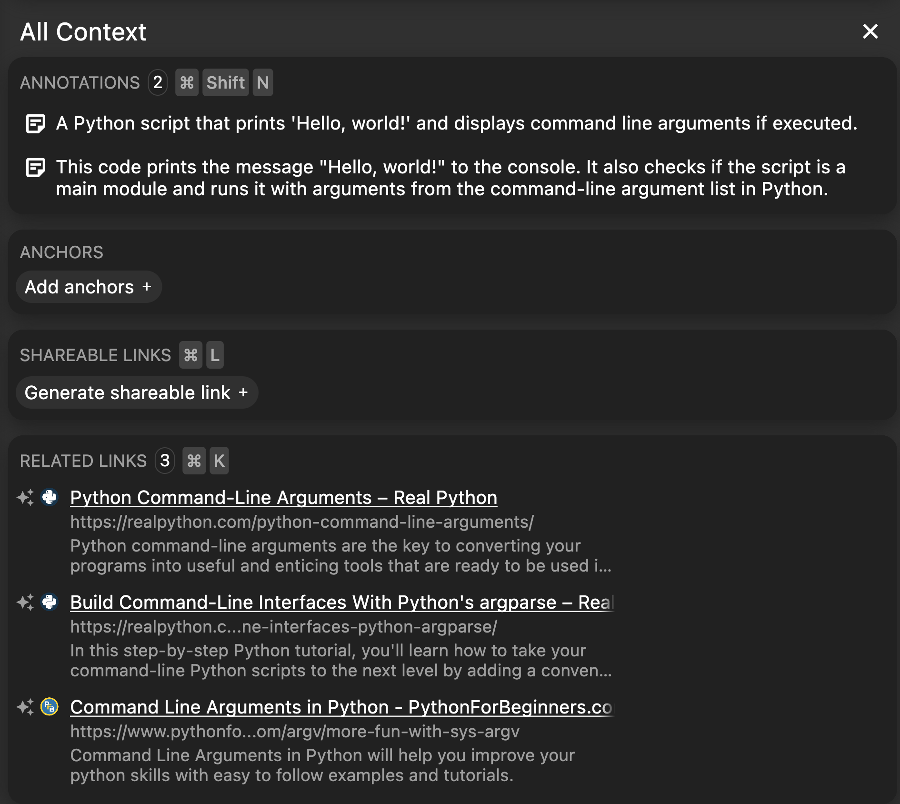

Pieces allows you to save code snippets and automatically add context using AI. This helps you keep track of important code, make it easily searchable, and provide additional information like tags and relevant documentation links.

## Prerequisites

Before you begin, ensure you have:

- [Pieces installed](/installation-getting-started/what-am-i-installing) on your machine.
- A code snippet to save. This can be a code file, clipboard content, or an image of code.

Example code snippet:

```python
name = input("What is your name? ")
print("Hello, " + name + "!")
```

Or download as a Python file [here](./resources/helloworld.py).

## Steps

### 1. Open Pieces Desktop

Launch Pieces Desktop using one of the following methods:
- Click on Pieces OS in your menu bar or system tray, and select **Launch Pieces for Developers**.
- Run Pieces from your Windows Start menu, macOS Applications folder, or Linux Applications menu.

Once open, select the **Saved Materials** tab from the left-hand menu.



### 2. Add the Code Snippet

Add your code snippet to Pieces in one of the following ways:
- **From a code file**: Drag and drop the file into the Pieces app.
- **From an image file**: Drag and drop the file into the Pieces app. Pieces will convert the text in the image to a code snippet.
- **From your clipboard**: Copy the code snippet and paste it into the Pieces app using _Ctrl+V_ (Windows/Linux) or _Cmd+V_ (macOS).

Pieces will automatically add context such as tags, links to documentation, and other relevant information.

### 3. Review the Context

After processing, review the snippet and the added context:

- Select the snippet in the list of saved materials if it is not already selected.
- The top panel shows the code snippet, and the bottom panel shows a preview of the added context.



In the _Context Preview_ pane, review the metadata automatically added by Pieces, including:
- A description of the code snippet
- Suggested searches for similar snippets
- Suggested links for more information
- Tags
- Related files and folders
- Related people

Use the **View all context** button to expand the _Context Preview_ to see more details.



This will open the _All Context_ pane, displaying more detailed information.



## Next Steps

- [Manage your code snippet](/features/managing-saved-materials)
- [Share your code snippet](/features/one-click-snippet-sharing)
