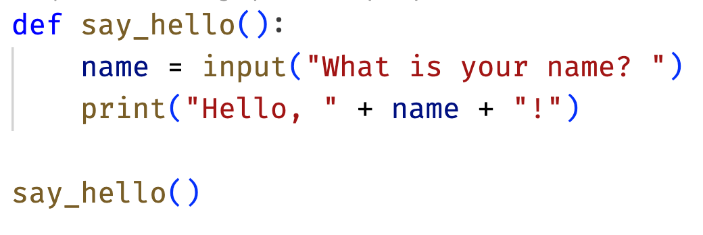

import Tabs from '@theme/Tabs';
import TabItem from '@theme/TabItem';

Pieces allows you to save code snippets and automatically add context using AI. This helps you keep track of important code, make it easily searchable, and provide additional information like tags and relevant documentation links.

The generated context includes:

- The programming language
- A title for the code snippet
- A set of generated tags
- A description for what the code is doing
- Suggestions for searches to learn more about the concepts in the snippet
- Any people related to this snippet. This is found from the Git history if the file is in a Git repository

## Prerequisites

<Tabs groupId="pieces-component" queryString>
<TabItem value="visual-studio-code" label="VS Code">

Before you begin, ensure you have:

- [Pieces installed](/installation-getting-started/what-am-i-installing) and running on your machine
- The [Visual Studio Code Pieces Extension](vscode:extension/MeshIntelligentTechnologiesInc.pieces-vscode) installed
- A code file, folder of code, or project open in VS Code

</TabItem>
<TabItem value="desktop" label="Pieces Desktop">

Before you begin, ensure you have:

- [Pieces installed](/installation-getting-started/what-am-i-installing) and running on your machine
- A code snippet to save. This can be a code file, code on your clipboard, or a screenshot of code.

    Example code snippet:

    ```python
    def say_hello():
        name = input("What is your name? ")
        print("Hello, " + name + "!")

    say_hello()
    ```

    Or download as [a Python file](./resources/helloworld.py).

    If you want to try out an image, [download](./media/images/python-code.webp) this one:

<div class="container">
  <div class="row">
    <div class="col col--1"></div>
    <div class="col col--6">
    
    </div>
  </div>
</div>
</TabItem>
<TabItem value="web" label="Pieces Web Extension">

Before you begin, ensure you have:

- [Pieces installed](/installation-getting-started/what-am-i-installing) and running on your machine
- A supported browser. Currently the Pieces Web Extension is available for Chrome, Edge, Firefox, Brave, and Opera.
- The relevant Pieces Extension installed
    - For Chrome, Brave, and Opera use the [Pieces Chrome Extension](https://chrome.google.com/webstore/detail/pieces-save-code-snippets/igbgibhbfonhmjlechmeefimncpekepm)
    - For Edge use the [Pieces Edge Add-On](https://microsoftedge.microsoft.com/addons/detail/pieces-save-code-snippet/hglfimcdgonaeeobjckfdabcldfidmim)
    - For Firefox use the [Pieces FireFox Add-On](https://addons.mozilla.org/en-US/firefox/addon/pieces-save-code-from-the-web/).
- A web page with code snippet to save. For example:

    ```python
    def say_hello():
        name = input("What is your name? ")
        print("Hello, " + name + "!")

    say_hello()
    ```
</TabItem>
<TabItem value="jetbrains" label="JetBrains">

Before you begin, ensure you have:

- [Pieces installed](/installation-getting-started/what-am-i-installing) and running on your machine
- The [Pieces JetBrains Plugin](https://plugins.jetbrains.com/plugin/17328-pieces) installed in your JetBrains IDE of choice
- A code file, folder of code, or project open in your JetBrains IDE

</TabItem>
<TabItem value="obsidian" label="Obsidian">

Before you begin, ensure you have:

- [Pieces installed](/installation-getting-started/what-am-i-installing) and running on your machine
- The [Pieces Obsidian Plugin](https://obsidian.md/plugins?id=pieces-for-developers) installed
- A note in Obsidian with a code block

</TabItem>
<TabItem value="visual-studio" label="Visual Studio">

Before you begin, ensure you have:

- [Pieces installed](/installation-getting-started/what-am-i-installing) and running on your machine
- The [Visual Studio Pieces Extension](https://marketplace.visualstudio.com/items?itemName=MeshIntelligentTechnologiesInc.PiecesVisualStudio) installed
- A code file, folder of code, or project open in Visual Studio

</TabItem>
</Tabs>

## Steps

### 1. Find the code to save

<Tabs groupId="pieces-component" queryString>
<TabItem value="visual-studio-code" label="VS Code">

Inside an open file in Visual Studio Code, select the code block you want to save as a snippet.


</TabItem>
<TabItem value="desktop" label="Pieces Desktop">

Locate the code you want to save as a snippet.

- If you want to save a snippet from your clipboard, copy the code
- If you want to save a snippet from a code or image file, locate the relevant file

</TabItem>
<TabItem value="web" label="Pieces Web Extension">

In your browser, locate the code block on a web page that you want to save as a snippet.

When you hover your mouse over it, you should see Pieces options below the code block.


</TabItem>
<TabItem value="jetbrains" label="JetBrains">

Inside an open file in your JetBrains IDE, select the code block you want to save as a snippet.


</TabItem>
<TabItem value="obsidian" label="Obsidian">

In Obsidian, locate the code block in a note that you want to save as a snippet.

When you hover your mouse over it, you should a Pieces button on the bottom of the code block.


</TabItem>
<TabItem value="visual-studio" label="Visual Studio">

Inside an open file in Visual Studio, select the code block you want to save as a snippet.


</TabItem>
</Tabs>

### 2. Save the Code Snippet

<Tabs groupId="pieces-component" queryString>
<TabItem value="visual-studio-code" label="VS Code">

Right click on the selected code, and select _Pieces -> Save Current Selection to Pieces_.


</TabItem>
<TabItem value="desktop" label="Pieces Desktop">

In Pieces Desktop, ensure the _Saved Materials_ tab is visible.

<div class="container">
  <div class="row">
    <div class="col col--4">


    </div>
  </div>
</div>

- If you have copied code to the clipboard, use the _Save Clipboard Contents_ button on the bottom left to save the contents of your clipboard as a snippet.

<div class="container">
  <div class="row">
    <div class="col col--1"></div>
    <div class="col col--2">


    </div>
  </div>
</div>

- If you have a code file, or a screenshot of code, drag and drop this into Pieces Desktop.

<div class="container">
  <div class="row">
    <div class="col col--1"></div>
    <div class="col col--6">


    </div>
  </div>
</div>

</TabItem>
<TabItem value="web" label="Pieces Web Extension">

Hover your mouse over the code snippet, and select the _Copy and Save_ button that will appear.


</TabItem>
<TabItem value="jetbrains" label="JetBrains">

Right click on the selected code, and select _Save to Pieces_.


</TabItem>
<TabItem value="obsidian" label="Obsidian">

Select the Pieces button on the bottom of the code block to see the various Pieces Options. Select _Save code to Pieces_.


</TabItem>
<TabItem value="visual-studio" label="Visual Studio">

Right click on the selected code, and select _Pieces -> Save to Pieces_.


</TabItem>
</Tabs>

The snippet will be saved to Pieces. Pieces will automatically add context such as tags, links to documentation, information extracted from any Git history, and other relevant information.

### 3. Review the Enriched Snippet

After Pieces has had a few seconds to process the snippet, review the snippet and the added context.

<Tabs groupId="pieces-component" queryString>
<TabItem value="visual-studio-code" label="VS Code">

Select the _Pieces Explorer_ from the Activity Bar. This will then show all the saved snippets, grouped by programming language.

<div class="container">
  <div class="row">
    <div class="col col--6">


    </div>
  </div>
</div>

Select the new snippet to see the generated annotations.


</TabItem>
<TabItem value="desktop" label="Pieces Desktop">

From the _Saved Materials_ tab, there is a list of the saved snippets on the left-hand side. When you select a snippet, the code and annotations are shown in the main pane.


To view all the annotations, select the _View All Context_ button.


This will expand a pane allowing you to see all the captured context.


</TabItem>
<TabItem value="web" label="Pieces Web Extension">

Select the _Pieces Web Extension_ from the browser toolbar.

<div class="container">
  <div class="row">
    <div class="col col--8">


    </div>
  </div>
</div>

This will bring up the Pieces Web Extension pane. Select _Saved Snippets_ to show a list of all the saved snippets.

<div class="container">
  <div class="row">
    <div class="col col--8">


    </div>
  </div>
</div>

Select the new snippet to see the generated annotations.

<div class="container">
  <div class="row">
    <div class="col col--8">


    </div>
  </div>
</div>

</TabItem>
<TabItem value="jetbrains" label="JetBrains">

Select _Pieces_ from the Tool Bar. This will then show all the saved snippets, grouped by programming language.

<div class="container">
  <div class="row">
    <div class="col col--6">


    </div>
  </div>
</div>

Double-click the new snippet to see the generated annotations.


</TabItem>
<TabItem value="obsidian" label="Obsidian">

Select _Pieces For Developers_ from the Ribbon.

<div class="container">
  <div class="row">
    <div class="col col--6">


    </div>
  </div>
</div>

From the pane that appears, make sure _Saved Materials_ is selected. This will then show all the saved snippets. Select the newly added snippet to see the code.

<div class="container">
  <div class="row">
    <div class="col col--6">


    </div>
  </div>
</div>

</TabItem>
<TabItem value="visual-studio" label="Visual Studio">

Open the Pieces Explorer by selecting _View -> Other Windows -> Pieces -> Pieces Explorer_.


Now that the Pieces Explorer is open, it will then show all the saved snippets, grouped by programming language.

<div class="container">
  <div class="row">
    <div class="col col--7">


    </div>
  </div>
</div>

Select the new snippet to see the generated annotations.


</TabItem>
</Tabs>

The generated enrichments include:

- The programming language
- A title for the code snippet
- A set of generated tags
- A description for what the code is doing
- Suggestions for searches to learn more about the concepts in the snippet
- Any people related to this snippet. This is found from the Git history if the file is in a Git repository

## Next Steps

- [Manage your code snippet](/features/managing-saved-materials)
- [Share your code snippet](/features/one-click-snippet-sharing)
